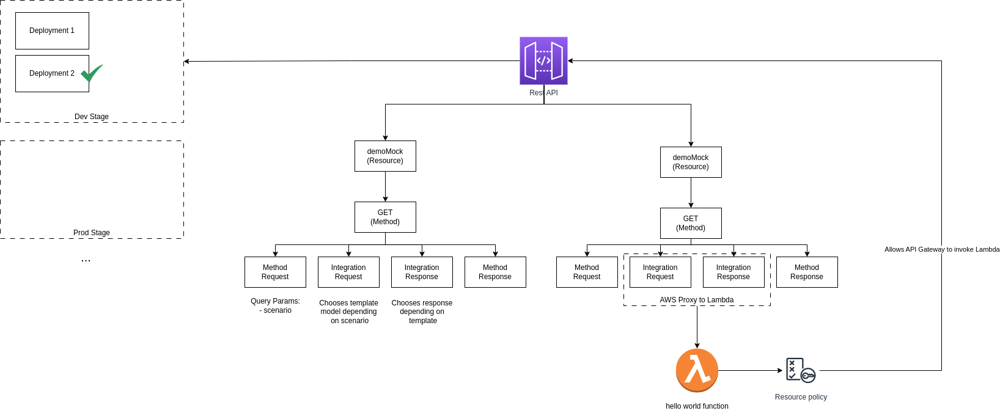

# API Gateway

This repository deploys an API Gateway with an Rest API that exposes resources to the internet.

Resources:
- `/demoMock`: Uses the `MOCK` integration and returns a response body based on the `scenario` Query param.
- `/awsProxyDemo`: Uses the `AWS_PROXY` integration to trigger a Lambda function and returns its response.

The diagram below depicts the main components implemented in this architecture.

