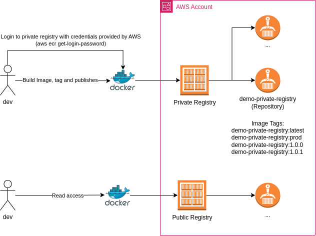

# Elastic Container Registry

This folder implements the architecture described in the diagram below:



## Running examples

```
aws cloudformation deploy --template-file ./cloudformation.yml --stack-name ecr-demo-stack
```

Once finished, destroy the stack using:

```
aws cloudformation delete-stack --stack-name ecr-name-demo-stack
```

## Publishing Images
Please check the [demo-private-repository](./demo-private-repository/) to build an publish images to the repo.

## Scan
Once you push the image, you should be able to check the basic scan output in the AWS Console. The ECR Repository is configured to trigger the scan on image's push.

Even though the configuration per repository is deprecated, I couldn't find a way to configure the Private Registry Scan through cloudformation.

## Image Lyfe cicle rules
The Repository has a image life cycle rule that expires the images with tag prefix `prod` everytime a new image with the tag prefix `prod` is pushed. You can test it by pushing 2 images with a tag prefix `prod`, however, it takes up to 24h to expiry the image.
