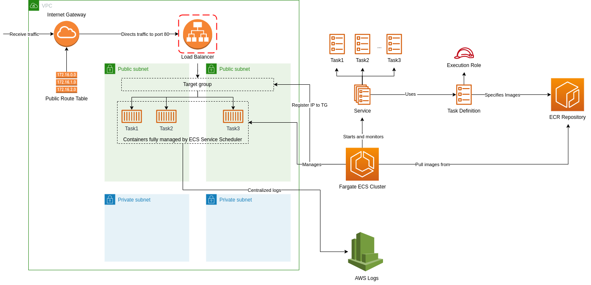

# Fargate Demo
This demos creates a ECS Cluster with Fargate as a Capacity Provider as well as the networking infrastructure, then Launches an ECS Service behind a Load Balancer using an Docker Image published in ECR.

**Important Once you deploy the cloud formation stack and the ECR is created you have to push the image to ECR, the app-server folder describes how to do it. Otherwise, the service deployment will fail.**



## Deploy the cloudformation
To deploy run the command below:

```
aws cloudformation deploy --template-file ./cloudformation.yml --stack-name ecs-fargate-demo-stack --capabilities CAPABILITY_NAMED_IAM
```