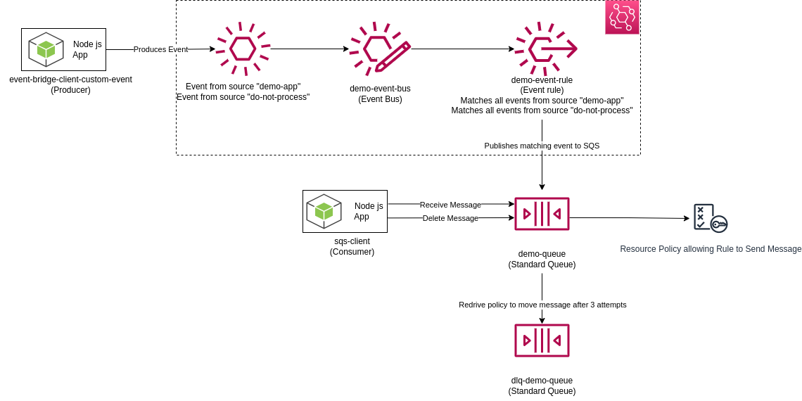

# Event-Bridge
This folder provides the IaaC and the Applications to reproduce the following architecture:

## Description
In this demo a **Producer** Node Js application called [event-bridge-client-custom-event](./event-bridge-client-custom-event/) publishes two custom event to a **Custom Event Bus**. One event has the source `demo-app` and the other `do-not-process`.

The Event Bus applies the **Rules**' event pattern to determine if the events are a match. In this example, the rule is configured to match event's sources abovementioned and to publish it to a SQS **Standard queue**. A **Consumer** [Node Js application](./sqs-client/) using the AWS SDK receives and deletes the messages from the queue. Messages from the source `do-not-process` are received but not deleted which eventually leads them to a DLQ.

The [infrastructure](./infrastructure/) contains the cloudformation template that can be used to deploy the stack in your AWS Cloud provider.