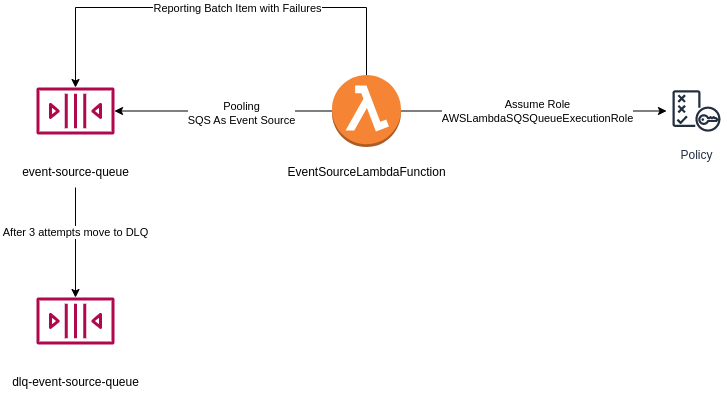

# sam-event-source-invocation
A project that deploys a Lambda function using SQS as event source. The lambda processes messages with the attribute `processed` as `true`, otherwise, uses partial success and retry failed messages until it forwards to a DLQ.



This project uses the [SAM programming model](https://docs.aws.amazon.com/serverless-application-model/latest/developerguide/serverless-sam-cli-install.html).

- `src`: Lambda source code
- `template.yaml`: infrastructure

## Deploy the sample application

To build and deploy your application for the first time, run the following in your shell:

```bash
sam build
sam deploy --guided
```

## Publishing Messages to the Queue
To publish replace the command below with the region and your account info.

```
aws sqs send-message --queue-url https://sqs.<replace>/event-source-queue --message-body "{\"process\": false}"
aws sqs send-message --queue-url https://sqs.<replace>/event-source-queue --message-body "{\"process\": true}"
```

## Cleanup

To delete the sample application that you created, use the AWS CLI. Assuming you used your project name for the stack name, you can run the following:

```bash
sam delete --stack-name sam-event-source-invocation
```