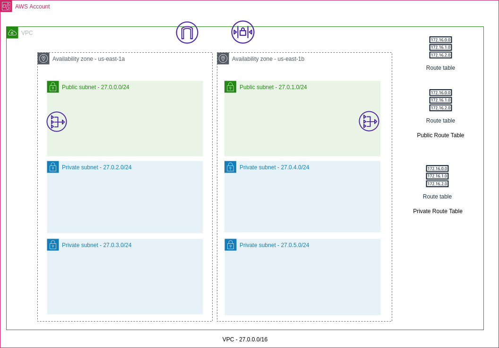

# Three Tier Architecture
This is an example of an architecture using the three-tier architecture on AWS.

The three tier architecture consists of 3 tiers as follows:
1. Public Tier for presentation purpose
2. Private Tier for business logic
3. Private Tier for secure data storage

## Characteristics

- High Availability
  - Redundancy between two availability zones.

## Application Implementation

For this three tier application example we are going to use a simple application that can manage projects. This app is built in three parts, each part is a separated service of the app:

1. **Database**: A instance of PostgreSQL database which stores the project data.
2. **Backend**: A Typescript server application based on NestJS. This app connects the **Database** and exposes the data through a REST API.
3. **Frontend**: A Javascript server side render application based on Express. This app consumes the **Backend** and serves dynamic and static HTML.

## Infrastructure Implementation

Below are the details of the architecture implementation.

### VPC and Subnets

For this example, you'll create a Virtual Private Cloud network (VPC) with CIDR block of `27.0.0.0/16` which supports 65353 IP addresses. Within the VPC we'll create 6 subnets. These subnets will span two availability zones, we do that to ensure high availability. The subnet are using the CIDR block from `27.0.0.0/24` to `27.0.5.0/24`, meaning that each subnet will have around 256 IP addresses (not considering the IPs reserved from AWS).
For this example we will use two types of subnet:

- Public: The public subnet have direct inbound/outbound traffic to the internet. An internet gateway (IG) is attached to the VPC, and the Public Route table provides routing to IG. The public subnets are configured to auto assign IPv4 to EC2 instances.
- Private: The private subnets will receive traffic only from within the VPC. The EC2 instances in the private subnets will use a NAT Gateway to initiate traffic to the internet. The Private Route Table provides routing rules to the Public NAT Gateway.

When the VPC is create a default route table is created and an Network Access List Control. They are depicted in the diagram, but no changes were applied to them. Below you can see how the VPC will look like:

### Deploying applications in the presentation tier

The application running in the Presentation tier is going to receive traffic from the internet, therefore this application runs within a public subnet.

In order to deploy the application we need compute resources, in this example we'll use the EC2 Auto Scaling to manage our EC2 instances. When using the auto scaling groups we can set up rules to monitor EC2 metrics and trigger events of scale out or scale in (Horizontal Scaling). In addition, we can specify a set of subnets in different availability zones to run the EC2 instances, therefore, adding High Availability in cases where an availability zone fails.

### Configuring the Auto Scaling Group

The Auto Scaling groups requires:

- Capacity limits
- EC2 Launch Template
- Networking
- Load Balancer

#### Capacity Limits

- Desired capacity: Initial state. It maintain this number of instances unless the scaling policies change it.
- Minimum capacity: The minimum number of machines running.
- Maximum capacity: The maximum number of machines running.

#### EC2 Launch Templates

The Auto Scaling group uses an EC2 Launch Template the base configuration for the EC2 machines. The template can be used to specify the AMI, the instance types, key pair, network, the storage, the IAM role and so on.

For this example the Launch template uses:

- AMI: Amazon Linux 2
- Instance type: `t2.small`
- Security group - Allowing traffic on ports:
  - 3000 from the load balancer security group
- EBS Volume: 8gb General purpuse 2 (gp2)
  - Using the delete on termination option. This deletes volumes attached to EC2 being terminated.
- Role: Allows access to S3
- User Data: Script to download code from S3, install dependencies and run in the machine.

The launch templates supports versions allowing to change the template without impacting existing Auto Scaling groups using it.

#### Networking

We specify both public subnets tolerance to failing availability zones. It's important that the subnets in this Auto Scaling Group have the auto IPv4 assignment enabled.

#### Load Balancer

When specifying a Load Balancer in the ASG, when adding new EC2 instances, these instances are automatically registered in the ELB allowing then to automatically receive traffic, thus, automatically scaling your app.

The final diagram looks like this:

